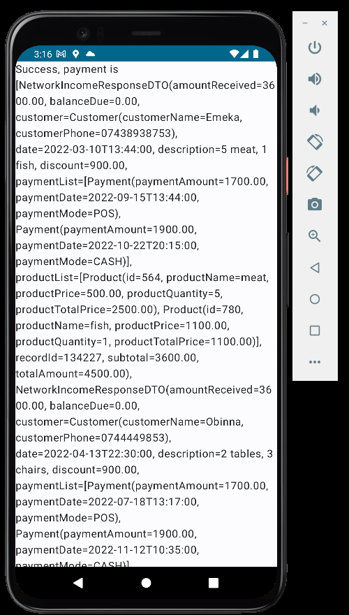

# Quick Links

[IncomeAPI class](./app/src/main/java/com/uxstate/networkincometest/data/remote/api/IncomeAPI.kt)

[DTO classes](./app/src/main/java/com/uxstate/networkincometest/data/remote/dto)

[Repository Implementation class](./app/src/main/java/com/uxstate/networkincometest/data/remote/repository/IncomeRepositoryImpl.kt)

[Building Retrofit Object](./app/src/main/java/com/uxstate/networkincometest/di/AppModule.kt)

[ViewModel Class](./app/src/main/java/com/uxstate/networkincometest/presentation/screens/home_screen/HomeViewModel.kt)

 &nbsp;

