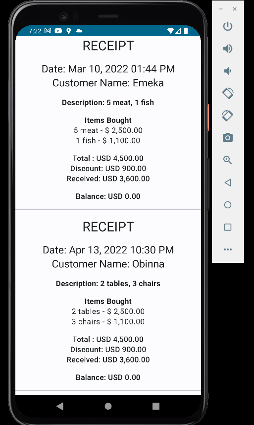

# Quick Links

[IncomeAPI class](./app/src/main/java/com/uxstate/networkincometest/data/remote/api/IncomeAPI.kt) - Defines the Retrofit @GET API request with a single function

[DTO classes](./app/src/main/java/com/uxstate/networkincometest/data/remote/dto) - This package Stores the converted Kotlin Objects from the JSON String

[Repository Implementation class](./app/src/main/java/com/uxstate/networkincometest/data/remote/repository/IncomeRepositoryImpl.kt) - Repository Code with Single Source of Truth, simply makes the api request and catches errors if any

[App Module ](./app/src/main/java/com/uxstate/networkincometest/di/AppModule.kt) - Dependency injection module to create Retrofit, client, logging and use cases

[ViewModel Class](./app/src/main/java/com/uxstate/networkincometest/presentation/screens/home_screen/HomeViewModel.kt) - This class holds the state

[Model Class](./app/src/main/java/com/uxstate/networkincometest/domain/model/ReceiptItem.kt) - Has the relevant data fields, uses BigDecimal as well as LocalDateTime

[DateUtilFunctions](./app/src/main/java/com/uxstate/networkincometest/util/DateUtilFunctions.kt) - Converts date JSON String to LocalDateTime and then back to formatted Human Readable Dates

[String Value XML](./app/src/main/res/values/strings.xml) - nothing fancy here, just string resource with placeholder to format BigDecima and specify currency/dollar symbol and put those 2 decimal places

[ReceiptItemComposable](./app/src/main/java/com/uxstate/networkincometest/presentation/screens/home_screen/components/ReceiptItemComposable.kt) - Quick Composable file to reader the data points, nothing to worry about if you are not familiar with Compose, XML will do the same stuff.

 &nbsp;&nbsp;&nbsp;&nbsp;&nbsp;
&nbsp;&nbsp;&nbsp;&nbsp;&nbsp;

